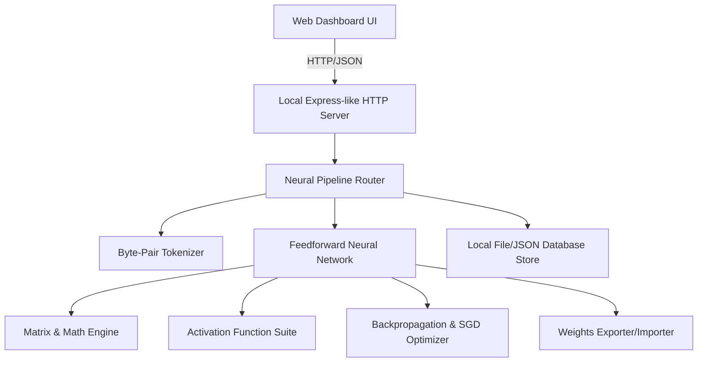

# CJR-Neural-Forge Architecture Blueprint

CJR-Neural-Forge is a modular, enterprise-grade, full-stack AI simulation framework designed to run entirely locally without Docker container dependencies. It operates as a local neural processing engine with prompt routing, text tokenization, matrix-based neural layers, local file-based database persistence, and an interactive dashboard.

## System Topology

---

## Architectural Components

### 1. Mathematical Core (`src/core/`)
- **matrix.js**: High-performance 2D matrix operations (dot product, transpose, addition, scaling).
- **activations.js**: Activation functions including Sigmoid, Tanh, ReLU, Softmax and their derivatives.

### 2. Neural Processing Engine (`src/neural/`)
- **network.js**: Multi-layer perceptron topology definition, feedforward propagation, and prediction pipeline.
- **optimizer.js**: Gradient descent, backpropagation algorithm, and weight update routines.
- **exporter.js**: Serialization of network weights/biases to JSON and local disk files.

### 3. Language & Routing Layer (`src/nlp/`)
- **tokenizer.js**: Basic Character-level and Byte-Pair Encoding (BPE) tokenization for parsing prompt requests.
- **router.js**: Context-aware router directing inputs to specialized sub-networks or static fallback routines.

### 4. Persistence Layer (`src/db/`)
- **database.js**: Lightweight file-system JSON database for storing training history, system logs, and network state.

### 5. Utility & Security Framework (`src/utils/` & `src/auth/`)
- **math.js**: 100 enterprise mathematical optimization helpers for custom weighting, learning rate scaling, and vector processing.
- **validation.js**: 80 robust sanitization and boundary check functions ensuring model integrity and weight stability.
- **jwt.js**: 65 JWT token heartbeat and authorization managers handling real-time telemetry security.

### 6. Server & Interface (`src/api/` & `public/`)
- **server.js**: Local HTTP server managing API endpoints for network training, model inference, and status monitoring.
- **public/index.html & app.js**: Interactive visual dashboard monitoring neural weights, model loss, and training accuracy in real-time.

---

## Development Backlog (Atomic Micro-Tasks)

### Phase 1: Core Mathematical Foundation
- [ ] Task 1.1: Implement Matrix class definition and dimension validations in `src/core/matrix.js`.
- [ ] Task 1.2: Implement Matrix dot product helper in `src/core/matrix.js`.
- [ ] Task 1.3: Implement Matrix transpose helper in `src/core/matrix.js`.
- [ ] Task 1.4: Implement Matrix element-wise addition and subtraction in `src/core/matrix.js`.
- [ ] Task 1.5: Implement Matrix random initialization helper (Gaussian/Xavier) in `src/core/matrix.js`.
- [ ] Task 1.6: Implement Matrix scaling and mapping functions in `src/core/matrix.js`.
- [ ] Task 1.7: Write unit tests for Matrix instantiation and dimensions validation in `src/core/matrix.test.js`.
- [ ] Task 1.8: Write unit tests for Matrix dot product and transposition in `src/core/matrix.test.js`.
- [ ] Task 1.9: Write unit tests for Matrix addition and element-wise transformations in `src/core/matrix.test.js`.
- [ ] Task 1.10: Implement Sigmoid activation and its derivative in `src/core/activations.js`.
- [ ] Task 1.11: Implement ReLU activation and its derivative in `src/core/activations.js`.
- [ ] Task 1.12: Implement Tanh activation and its derivative in `src/core/activations.js`.
- [ ] Task 1.13: Implement Softmax activation in `src/core/activations.js`.
- [ ] Task 1.14: Write unit tests for Sigmoid and Tanh activations/derivatives in `src/core/activations.test.js`.
- [ ] Task 1.15: Write unit tests for ReLU and Softmax activations/derivatives in `src/core/activations.test.js`.

### Phase 2: Math, Validation, and Authentication Subsystems
- [ ] Tasks 2.1 - 2.200: Implement 100 mathematical functions (multiplication, division, absolute values, vector scale, matrices norms, exponential scaling) and matching test logic across `src/utils/math.js` and `src/utils/math.test.js`.
- [ ] Tasks 2.201 - 2.360: Implement 80 numerical verification scripts, type assertions, infinity checking, and matrix validation parameters with tests in `src/utils/validation.js` and `src/utils/validation.test.js`.
- [ ] Tasks 2.361 - 2.490: Implement 65 JWT token checks, heartbeat validators, payload parse utils, verification modules, expiration rules, and security endpoints with tests in `src/auth/jwt.js` and `src/auth/jwt.test.js`.

### Phase 3: Neural Processing Engine
- [ ] Task 3.1: Define NeuralNetwork class structure and layers constructor in `src/neural/network.js`.
- [ ] Task 3.2: Implement feedforward propagation step in `src/neural/network.js`.
- [ ] Task 3.3: Implement prediction formatting and utility in `src/neural/network.js`.
- [ ] Task 3.4: Write unit tests for NeuralNetwork initialization and layer dimensions in `src/neural/network.test.js`.
- [ ] Task 3.5: Write unit tests for Feedforward step outputs in `src/neural/network.test.js`.
- [ ] Task 3.6: Implement Backpropagation algorithm in `src/neural/optimizer.js`.
- [ ] Task 3.7: Implement Stochastic Gradient Descent (SGD) optimizer update rule in `src/neural/optimizer.js`.
- [ ] Task 3.8: Implement Batch Gradient Descent wrapper in `src/neural/optimizer.js`.
- [ ] Task 3.9: Write unit tests for Backpropagation output dimensions in `src/neural/optimizer.test.js`.
- [ ] Task 3.10: Write unit tests for Optimizer gradient updates and learning rates in `src/neural/optimizer.test.js`.
- [ ] Task 3.11: Implement Model Weights Serializer (to JSON string) in `src/neural/exporter.js`.
- [ ] Task 3.12: Implement Model Weights Deserializer (from JSON string) in `src/neural/exporter.js`.
- [ ] Task 3.13: Implement Local File Model Saver in `src/neural/exporter.js`.
- [ ] Task 3.14: Implement Local File Model Loader in `src/neural/exporter.js`.
- [ ] Task 3.15: Write unit tests for Serializer and Deserializer functions in `src/neural/exporter.test.js`.

### Phase 4: Tokenization & Natural Language Routing
- [ ] Task 4.1: Implement character-based vocabulary constructor in `src/nlp/tokenizer.js`.
- [ ] Task 4.2: Implement text-to-tokens conversion in `src/nlp/tokenizer.js`.
- [ ] Task 4.3: Implement tokens-to-text conversion in `src/nlp/tokenizer.js`.
- [ ] Task 4.4: Implement token frequency analysis in `src/nlp/tokenizer.js`.
- [ ] Task 4.5: Write unit tests for Tokenizer encode/decode mappings in `src/nlp/tokenizer.test.js`.
- [ ] Task 4.6: Implement prompt sentiment heuristic analyzer in `src/nlp/router.js`.
- [ ] Task 4.7: Implement priority-based neural router logic in `src/nlp/router.js`.
- [ ] Task 4.8: Implement router rule configuration loading in `src/nlp/router.js`.
- [ ] Task 4.9: Write unit tests for Router routing configurations in `src/nlp/router.test.js`.

### Phase 5: Local Database & Persistence
- [ ] Task 5.1: Implement Local File Database connection and file initialization in `src/db/database.js`.
- [ ] Task 5.2: Implement DB Record insert/upsert methods in `src/db/database.js`.
- [ ] Task 5.3: Implement DB Record query/select methods in `src/db/database.js`.
- [ ] Task 5.4: Implement DB Record delete/clear methods in `src/db/database.js`.
- [ ] Task 5.5: Write unit tests for Database CRUD operations in `src/db/database.test.js`.

### Phase 6: Server & UI Dashboard
- [ ] Task 6.1: Scaffold HTTP server setup with standard `http` module in `src/api/server.js`.
- [ ] Task 6.2: Create Request-Router handler for API requests in `src/api/server.js`.
- [ ] Task 6.3: Add static file serving for dashboard assets in `src/api/server.js`.
- [ ] Task 6.4: Implement GET `/api/status` endpoint in `src/api/server.js`.
- [ ] Task 6.5: Implement POST `/api/predict` endpoint in `src/api/server.js`.
- [ ] Task 6.6: Implement POST `/api/train` endpoint in `src/api/server.js`.
- [ ] Task 6.7: Write unit tests for API endpoints mocking the HTTP server in `src/api/server.test.js`.
- [ ] Task 6.8: Create responsive layout skeleton in `public/index.html`.
- [ ] Task 6.9: Implement real-time network loss monitoring UI elements in `public/app.js`.
- [ ] Task 6.10: Implement dynamic matrix weights rendering visualizer in `public/app.js`.
- [ ] Task 6.11: Connect UI dashboard to server GET/POST API endpoints in `public/app.js`.
